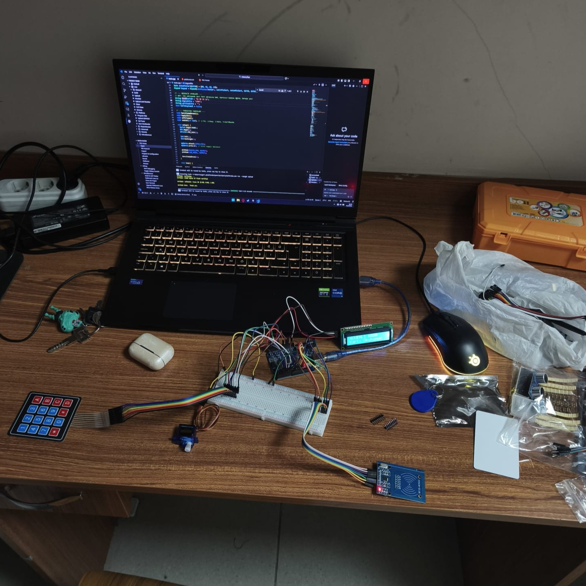

Dual-Layer Security: RFID + Keypad authentication.

Peripheral Integration: I2C LCD, Servo Motor, MFRC522 RFID, and 4x4 Keypad.

Security Features: Anti-theft alarm system after 3 failed attempts.

